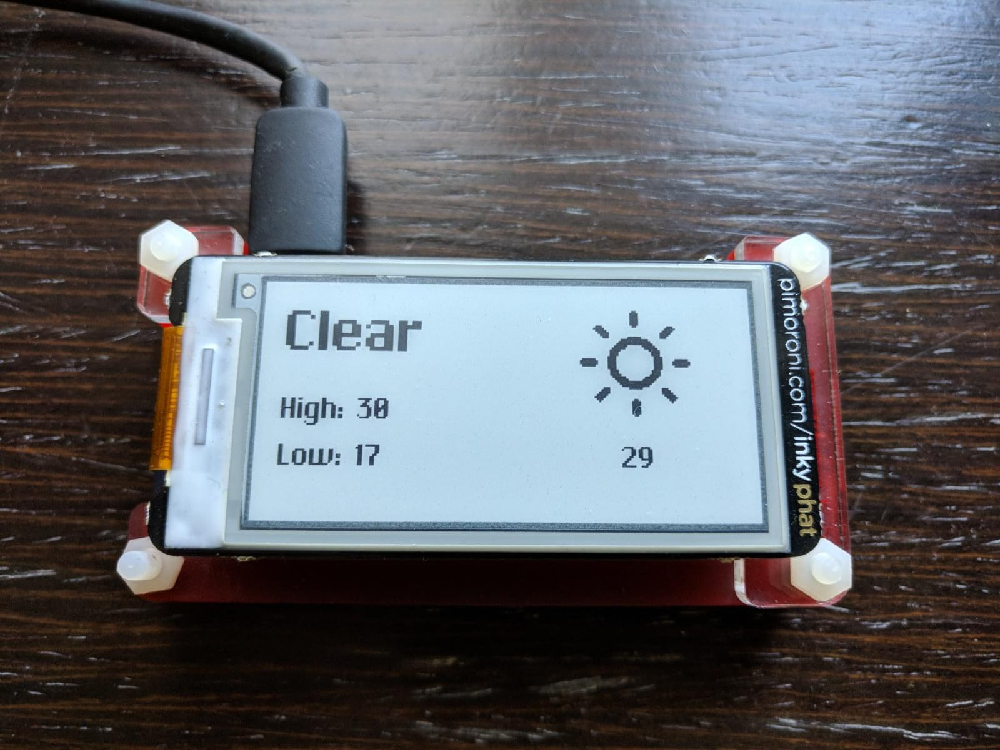

# Inky pHAT Dark Sky weather display

A Dark Sky weather display for the [Pimoroni Inky pHAT](https://learn.pimoroni.com/tutorial/sandyj/getting-started-with-inky-phat).  Displays a short summary of the current weather and temperature, today's highs and lows and uses Adam Whitcroft’s excellent [Climacons](http://adamwhitcroft.com/climacons/).



# Dependencies
- [Inky pHAT library](https://github.com/pimoroni/inky)
- sudo pip install requests

# Setup
Register for a free developer account at https://darksky.net/dev.  The API offers 1000 requests a day for free, which should be plenty for personal projects like this.
- Update config.py with the following

```
[weather]
api_key: your_dark_sky_api_token
location_lon: your_longitude
location_lat: your_latitude
units: uk2
```

# Running everything
From terminal, run `python inky-weather.py`.


# With Pimoroni's [Button SHIM support](https://github.com/pimoroni/button-shim)!
You can use the button SHIM to switch between weather displays (daily or weekly).  To do this, add the following to the config:

```
[raspberry_pi]
button_shim: True
```
Running `python inky-weather.py` now will keep the program open, allowing you to switch displays using the button SHIM.  If you have this setup, you might want to setup  a cronjob to run `weather.py` once every half hour or hour.

